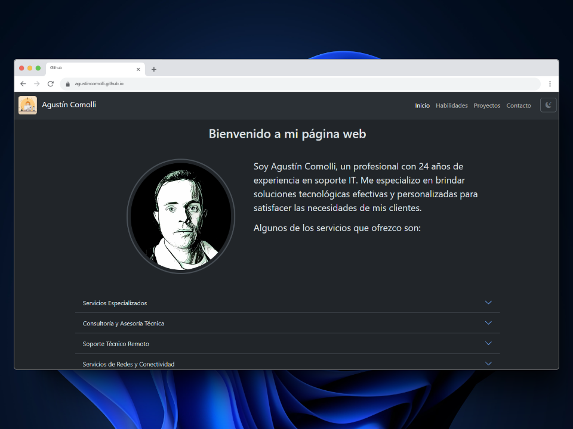

# Sitio Web de Agustín Comolli

Este repositorio contiene el código fuente para el sitio web personal de Agustín Comolli, un profesional de soporte en tecnología informática ubicado en Cañuelas, Buenos Aires, Argentina.



## Descripción

El sitio web es una plataforma que presenta los servicios de soporte técnico y consultoría informática ofrecidos por Agustín Comolli, así como sus habilidades en programación. Está diseñado para proporcionar información clara y accesible sobre los servicios disponibles, la experiencia del profesional, sus conocimientos en programación y formas de contacto.

## Estructura del Sitio

El sitio web consta de las siguientes páginas principales:

1. **Inicio (index.html)**: Página de bienvenida con una breve introducción y resumen de servicios.
2. **Acerca de (about.html)**: Información detallada sobre la experiencia y trayectoria de Agustín Comolli.
3. **Servicios (services.html)**: Lista completa de servicios ofrecidos, incluyendo descripciones detalladas.
4. **Programación (programming.html)**: Información sobre los conocimientos y habilidades de programación de Agustín, incluyendo tecnologías como Linux, Git, GitHub, HTML, CSS, JavaScript, Python, Bootstrap y Flask.
5. **Contacto (contact.html)**: Formulario de contacto y información de ubicación.

## Tecnologías Utilizadas

- HTML5
- CSS3
- JavaScript
- Bootstrap 5.2.3
- Bootstrap Icons 1.11.3

## Características

- Diseño responsivo para una óptima visualización en dispositivos móviles y de escritorio.
- Integración con Google Maps para mostrar la ubicación.
- Formulario de contacto funcional utilizando Formspree.
- Botón de WhatsApp para contacto rápido.
- Iconos de redes sociales en el pie de página.
- Página dedicada a habilidades de programación con logos de tecnologías.

## Instalación y Uso

1. Clona este repositorio:
   ```
   git clone https://github.com/agustincomolli/agustincomolli.github.io.git
   ```
2. Abre el archivo `index.html` en tu navegador web para ver el sitio localmente.

## Despliegue

El sitio está configurado para ser alojado en GitHub Pages. Cualquier cambio realizado en la rama principal se reflejará automáticamente en el sitio web publicado.

## Contribuciones

Las sugerencias y contribuciones son bienvenidas. Por favor, abre un issue para discutir los cambios propuestos antes de realizar un pull request.

## Contacto

Para más información o consultas, puedes contactar a Agustín Comolli:

- Teléfono: 02226 - 680056
- Sitio Web: [https://agustincomolli.github.io](https://agustincomolli.github.io)
- LinkedIn: [https://www.linkedin.com/in/agustincomolli/](https://www.linkedin.com/in/agustincomolli/)

## Licencia

Este proyecto está bajo la Licencia MIT. Consulta el archivo `LICENSE` para más detalles.