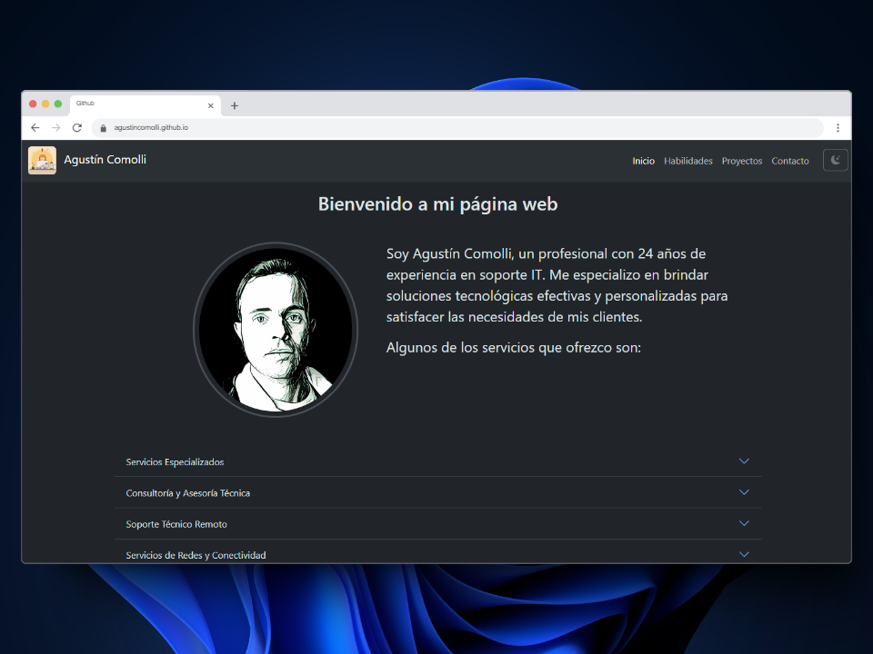

# Agustín Comolli — Soporte Técnico & Desarrollo

Sitio personal de Agustín Comolli: soporte técnico informático en Cañuelas, Buenos Aires, y portfolio de proyectos de programación.



**🔗 Sitio en vivo:** [agustincomolli.github.io](https://agustincomolli.github.io)


---

## Descripción

El sitio cumple dos objetivos: presentar los servicios de soporte técnico y consultoría informática de Agustín (su actividad principal), y mostrar sus proyectos personales de programación como portfolio secundario. Todo el contenido, la navegación y las llamadas a la acción están priorizados en función del primer objetivo.

## Estructura del sitio

| Página | Descripción |
|---|---|
| `index.html` | Home: presentación, disponibilidad, testimonios, proceso de trabajo, servicios y zona de cobertura. |
| `pages/contact.html` | Contacto vía WhatsApp o formulario. |
| `pages/skills.html` | Habilidades técnicas, agrupadas por categoría. |
| `pages/projects.html` | Proyectos de desarrollo, con link directo a cada repositorio. |

`skills.html` y `projects.html` viven agrupadas bajo el submenú **Programación** en la navegación, separadas de `Inicio` y `Contacto`, que son las páginas orientadas al servicio de soporte técnico.

## Funcionalidades

- **Tema claro / oscuro**, con la preferencia guardada en `localStorage` y aplicada sin parpadeo al cargar la página. La foto de portada cambia según el tema activo.
- **Botón flotante de WhatsApp**, visible en todo momento salvo cuando el pie de página está en pantalla (para no tapar los íconos de contacto).
- **Menú responsive** con submenú desplegable, optimizado para uso táctil en mobile.
- **Formulario de contacto** funcional vía [Formspree](https://formspree.io/), como alternativa al contacto directo por WhatsApp.
- **Accesibilidad**: enlace de "saltar al contenido", atributos ARIA en el selector de tema, textos alternativos en todas las imágenes, jerarquía de encabezados válida en cada página.
- **SEO**: meta descripciones y Open Graph propios por página, `sitemap.xml` y `robots.txt`.

## Tecnologías utilizadas

- HTML5 semántico
- CSS3 (variables propias sobre el sistema de theming de Bootstrap)
- JavaScript (vanilla, sin frameworks ni build step)
- [Bootstrap 5.3.3](https://getbootstrap.com/) + Bootstrap Icons 1.11.3
- [Formspree](https://formspree.io/) para el envío del formulario de contacto

## Estructura de carpetas

```
├── index.html
├── pages/
│   ├── contact.html
│   ├── skills.html
│   └── projects.html
├── scripts/
│   ├── change-theme.js       # tema claro/oscuro + año del footer
│   ├── whatsapp-float.js     # oculta el botón flotante sobre el footer
│   └── send-form.js          # envío del formulario de contacto
├── styles/
│   └── styles.css            # estilos propios (paleta, layout, componentes)
├── assets/
│   ├── images/
│   ├── icons/
│   └── fonts/
├── robots.txt
└── sitemap.xml
```

## Cómo agregar un proyecto nuevo

En `pages/projects.html`, cada proyecto es un bloque `<a class="project-card">`. Para sumar uno:

1. Subí una captura del proyecto a `assets/images/` (formato `.webp`).
2. Copiá un bloque `project-card` existente y actualizá: el `href` al repositorio, la imagen, el texto del `alt`, la categoría del badge (`project-badge--frontend`, `--backend`, `--juego`, `--libreria`, `--webapp` o `--tema`) y el título/descripción.

Las categorías de badge ya tienen su color definido en `styles.css`; una categoría nueva requiere agregar su propia variante ahí.

## Ejecutar el sitio localmente

No requiere instalación ni dependencias: es HTML/CSS/JS estático.

```bash
git clone https://github.com/agustincomolli/agustincomolli.github.io.git
cd agustincomolli.github.io
```

Abrí `index.html` directamente en el navegador, o levantá un servidor local simple:

```bash
python3 -m http.server 8000
```

y entrá a `http://localhost:8000`.

## Despliegue

El sitio se aloja en GitHub Pages directamente desde la rama `master`. Cualquier cambio subido a esa rama se refleja automáticamente en el sitio publicado, sin pasos de build adicionales.

## Contacto

- **WhatsApp:** [wa.me/5492226680056](https://wa.me/5492226680056)
- **Sitio web:** [agustincomolli.github.io](https://agustincomolli.github.io)
- **LinkedIn:** [linkedin.com/in/agustincomolli](https://www.linkedin.com/in/agustincomolli/)
- **GitHub:** [github.com/agustincomolli](https://github.com/agustincomolli)
